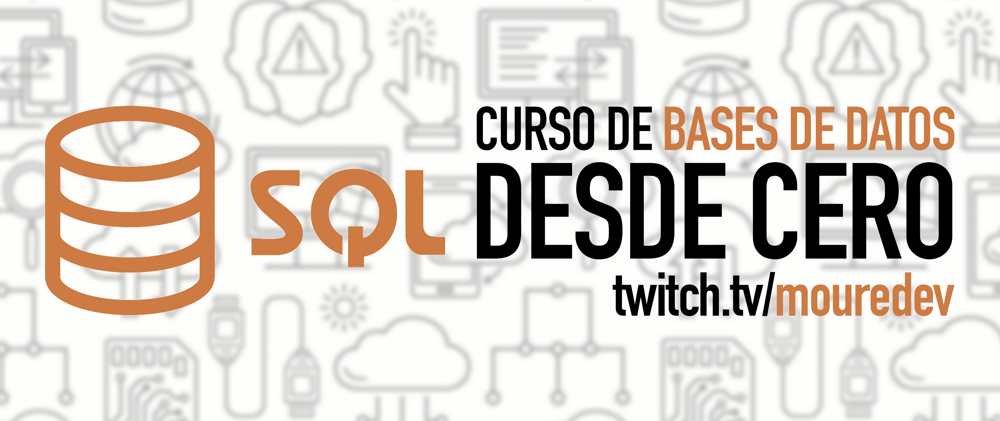

# Hello SQL

## Curso para aprender los fundamentos del lenguaje SQL y bases de datos relacionales

### Proyecto realizado durante emisiones en directo desde [Twitch](https://twitch.tv/mouredev)
> ##### Si consideras útil el curso, apóyalo haciendo "★ Star" en el repositorio. ¡Gracias!

## Próxima Clase: Muy pronto
### Avisaré en redes sociales y actualizaré este repositorio con la siguiente fecha.

## Clases anteriores

### Clase 1 (05/10/2023): Introducción, fundamentos e instalación MySQL 
#### ▶️ [Ver clase en vídeo](https://www.twitch.tv/videos/1943373276?t=00h19m44s)

### Clase 2 (12/10/2023): Instalación MySQL Workbench, creación BBDD, tablas y comandos SELECT
#### ▶️ [Ver clase en vídeo](https://www.twitch.tv/videos/1949226275?t=00h25m17s)

### Clase 3 (17/10/2023): Comandos SELECT y de escritura (INSERT, UPDATE y DELETE)
#### ▶️ [Ver clase en vídeo](https://www.twitch.tv/videos/1953432950?t=00h23m40s)

### Clase 4 (25/10/2023): Comandos DATABASE, TABLE y tipos de relación entre tablas
#### ▶️ [Ver clase en vídeo](https://www.twitch.tv/videos/1959296112?t=00h19m20s)

### Clase 5 (31/10/2023): Comandos JOIN
#### ▶️ [Ver clase en vídeo](https://www.twitch.tv/videos/1965141039?t=00h23m19s)

Durante el curso aprenderemos los fundamentos del lenguaje SQL y las bases de datos relacionales con ejemplos prácticos.
Nos centraremos en MySQL para llevar a cabo las clases, ya que es uno de los más usados en enseñanza y a nivel profesional. También utilizaremos PostgreSQL ya que es una de las bases de datos más populares de la actualidad. De todas formas, no debe preocuparte el motor de bases de datos utilizado, ya que SQL es un lenguaje estándar, por lo que se utilizará prácticamente igual en todas ellas. Una vez lo conozcas no tendrá dificultad alguna llevar esos conocimientos a otros sistemas.  
Todo el código estará disponible para que cualquiera pueda usarlo.

## Información importante y preguntas frecuentes

Este curso se encuentra en desarrollo. Todo el contenido se crea en directo desde [Twitch](https://www.twitch.tv/mouredev), y en este repositorio podrás encontrar las clases en vídeo, el código programado, enlaces de interés y la información de la próxima clase.

Una vez se finalice, se creará un vídeo que agrupe todas las clases y se publicará en [YouTube](https://www.youtube.com/@mouredev).

* Recuerda que he creado en el [Discord](https://discord.gg/mouredev) un canal "💾bases-de-datos" para que puedas comentar lo que quieras.

## Enlaces de interés

* [Documentación SQL](https://www.w3schools.com/sql/default.asp)
* [MySQL](https://mysql.com)
* [Descarga MySQL](https://dev.mysql.com/downloads/mysql/)
* [CLI MySQL](https://dev.mysql.com/doc/refman/8.0/en/mysql.html)
* [MySQL Workbench](https://dev.mysql.com/downloads/workbench)

#### Puedes apoyar mi trabajo haciendo "☆ Star" en el repo o nominarme a "GitHub Star". ¡Gracias!

Si quieres unirte a nuestra comunidad de desarrollo, aprender programación de Apps, mejorar tus habilidades y ayudar a la continuidad del proyecto, puedes encontrarnos en:

##  Hola, mi nombre es Brais Moure.
### Freelance full-stack iOS & Android engineer

Soy ingeniero de software desde hace más de 13 años. Desde hace 5 años combino mi trabajo desarrollando Apps con creación de contenido formativo sobre programación y tecnología en diferentes redes sociales como **[@mouredev](https://moure.dev)**.

### En mi perfil de GitHub tienes más información

